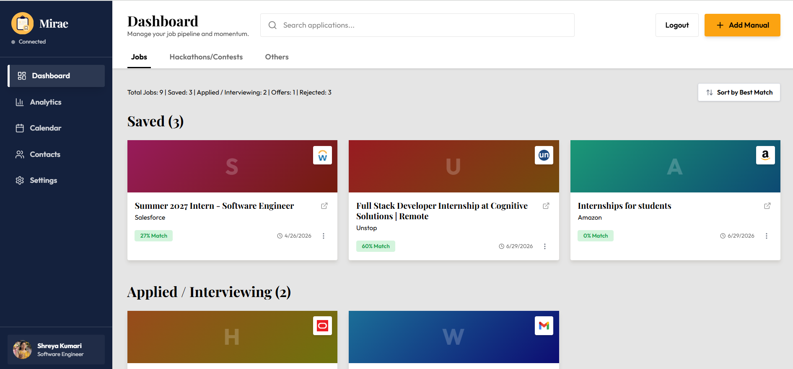
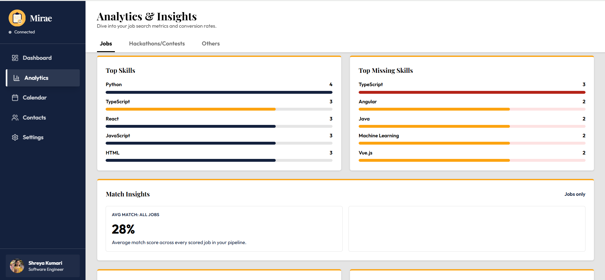
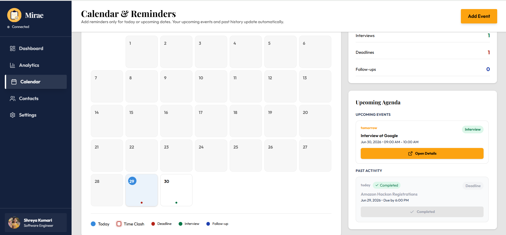
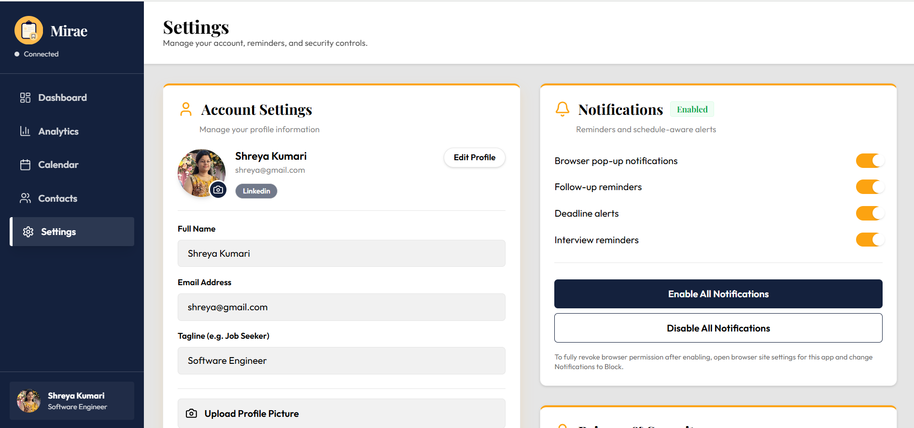
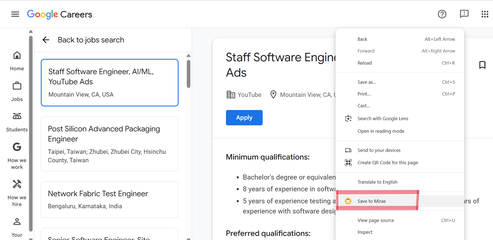

<p align="center">
  
</p>

<h1 align="center">Mirae</h1>

<p align="center">
  <strong>Autonomous Career Operating System</strong><br />
  <em>An event-driven platform that ingests recruiter emails, classifies opportunities with ML, and manages your entire job search pipeline — autonomously.</em>
</p>

<p align="center">
  
  
  
  
  
  
  
  
</p>

<p align="center">
  <a href="#-features">Features</a> •
  <a href="#-system-architecture">Architecture</a> •
  <a href="#-tech-stack">Tech Stack</a> •
  <a href="#-project-structure">Structure</a> •
  <a href="#-api-reference">API</a> •
  <a href="#-getting-started">Setup</a> •
  <a href="#-team">Team</a>
</p>

---

## 📖 Overview

**Mirae** (미래 — Korean for *"future"*) is a full-stack, event-driven career management platform that goes far beyond a simple job tracker. It combines a polished React dashboard, an intelligent Node.js backend, a Python ML microservice, Gmail Pub/Sub webhooks, real-time WebSockets, a Recruiter CRM, and a Chrome extension into a single autonomous system.

### What Makes Mirae Different

Most job trackers require you to manually log every application. Mirae **does it for you**:

1. **Passive Ingestion** — Connect your Gmail and Mirae automatically detects recruiter emails, classifies them (offer? rejection? interview invite?), updates your Kanban board, creates recruiter contacts, and schedules calendar reminders — all without you lifting a finger.
2. **Active Ingestion** — Right-click any job posting on the web and the Chrome extension scrapes, analyzes, and saves it with AI-extracted metadata in seconds.
3. **ML-Powered Classification** — A custom Scikit-Learn pipeline (TF-IDF + Logistic Regression) handles email relevance detection, category classification, and status inference locally, ensuring complete data privacy.
4. **Real-time Sync** — Socket.io WebSockets push every status change to your dashboard instantly. No refreshing.

---

## ✨ Features

### 🖥️ Dashboard

<picture>
  <source media="(prefers-color-scheme: dark)" srcset="public/screenshots/dashboard-dark.png">
  
</picture>

| Capability | Description |
|---|---|
| **Multi-Category Tracking** | Track **Jobs**, **Hackathons**, and **Others** (workshops, webinars, fellowships, scholarships) in organized tabs |
| **Kanban Pipeline** | Jobs flow through `Saved → Applied → Interviewing → Offer → Rejected` with drag-and-drop |
| **Hackathon Tracking** | Separate `Saved` and `Registered` sections for hackathons and contests |
| **Dynamic Summary Bar** | Context-aware summary statistics that update based on the active category tab |
| **Manual Entry** | Add opportunities manually with a structured form when not using the extension |
| **Search & Sort** | Full-text search and multi-criteria sorting across all tracked opportunities |
| **Duplicate Detection** | Automatic URL-based deduplication prevents saving the same posting twice |

### 🤖 Autonomous Event-Driven Pipeline

| Capability | Description |
|---|---|
| **Gmail Pub/Sub Webhooks** | Ingests recruiter emails in real-time via Google Cloud Pub/Sub push notifications — no polling |
| **6-Stage Email Processing** | (1) Acknowledge Google, (2) Decode & deduplicate via History ID, (3) Fetch message via Gmail API, (4) ML classification, (5) Kanban status update + Socket.io emit, (6) Auto-create contacts, calendar events, and offer metadata |
| **Local ML Microservice** | Python FastAPI service running a custom Scikit-Learn TF-IDF pipeline for relevance detection, category classification, and status inference — 100% local, zero data sent to third-party LLMs |
| **Cosine Similarity Matching** | ML `/match` endpoint uses TF-IDF cosine similarity to link incoming emails to existing job cards on your board |
| **Real-time WebSockets** | Socket.io pushes every mutation (status changes, new emails, reminders) to the React dashboard without page refresh |
| **Background Cron Jobs** | Daily at 8 AM: scans for stale "Interviewing" applications (7+ days), auto-creates follow-up calendar reminders, syncs to Google Calendar |
| **AI Skill Extraction** | Groq LLaMA 3.3 70B extracts technical skills from job descriptions and resumes, then computes match scores |
| **Privacy-First Design** | Email body text is held in-memory only during processing and is never persisted to the database |

### 👥 Recruiter CRM

| Capability | Description |
|---|---|
| **Auto-Created Contacts** | When a recruiter emails you, the system automatically creates a Contact record with their name, email, company, and role |
| **Interaction History** | Every email interaction is logged with timestamp and subject reference |
| **Job Linking** | Contacts are automatically linked to the relevant job card on your Kanban board |
| **Manual Updates** | Edit contact details, add phone/LinkedIn, change role (Recruiter/Hiring Manager/Interviewer) |

### 📊 Analytics & Insights

<picture>
  <source media="(prefers-color-scheme: dark)" srcset="public/screenshots/analytics-dark.png">
  
</picture>

| Capability | Description |
|---|---|
| **Category Tabs** | Switch between `Jobs`, `Hackathons`, and `Others` to view category-specific analytics |
| **Application Funnel** | Visual breakdown from Saved → Applied → Interviewing → Offer with conversion rates |
| **Status Distribution** | Donut chart showing Active vs Offers vs Rejected |
| **Pipeline Velocity** | Average days from application to interview across your tracked responses |
| **Top Skills** | Most frequently requested skills across all your tracked opportunities |
| **Skill Gap Analysis** | Top 5 skills you're missing — ranked by how often they appear in job requirements |
| **Match Insights** | Average match score across all jobs vs jobs that progressed to interview/offer |
| **Company Breakdown** | Top 10 companies by application volume with per-company success rates |
| **Rejection & Offer Breakdown** | Detailed lists of rejected and offered positions with reasons |

### 📅 Calendar

<picture>
  <source media="(prefers-color-scheme: dark)" srcset="public/screenshots/calendar-dark.png">
  
</picture>

| Capability | Description |
|---|---|
| **Month / Week / Day Views** | Full calendar interface with multiple view modes |
| **Event CRUD** | Create, edit, and delete events for interviews, deadlines, and follow-ups |
| **Dashboard Sync** | One-click sync of deadlines from tracked opportunities to the calendar |
| **Google Calendar Integration** | Two-way OAuth sync — events created in Mirae appear in Google Calendar and vice versa |
| **Auto-Created Events** | Interview dates extracted from recruiter emails are automatically added to the calendar |
| **Event Types** | Support for `interview`, `deadline`, `follow-up`, and `other` categories |

### 📋 Detail Panels

- **Jobs** → Full `ApplicationDetail` drawer with skill analysis, match score, contacts, notes, status history, and deadline
- **Hackathons & Others** → `OpportunityDetail` drawer with organizer, deadline, location, status, description, and source link

### 👤 Account & Profile

| Capability | Description |
|---|---|
| **JWT Authentication** | Secure registration and login with token-based auth (bcrypt password hashing) |
| **Protected Routes** | Frontend route guards ensure authenticated access to all dashboard pages |
| **Profile Management** | Update name, email, and profile photo |
| **Password Management** | Change password with current password verification |
| **Resume Upload** | Upload PDF/TXT resumes with automatic text extraction via `pdf-parse` and AI skill extraction |
| **Social Portfolio** | Manage links to GitHub, LinkedIn, portfolio sites, and more |
| **Account Deletion** | Full account removal with cascade data cleanup |

### ⚙️ Settings

<picture>
  <source media="(prefers-color-scheme: dark)" srcset="public/screenshots/settings-dark.png">
  
</picture>

| Capability | Description |
|---|---|
| **Notifications** | Configure follow-up reminders, deadline alerts, interview reminders, and browser notifications |
| **Notification Timing** | Choose `1 day`, `3 days`, or custom hours before events |
| **Appearance** | Toggle between `light` and `dark` themes with accent style and card layout preferences |
| **Gmail Integration** | Connect/disconnect Gmail for automatic email processing |
| **Google Calendar** | Connect/disconnect Google Calendar for two-way event sync |
| **Privacy & Security** | Security activity alerts and profile discoverability controls |
| **Data Management** | Clear all application data or reset settings to defaults |
| **Danger Zone** | Account deletion with confirmation modals |

### 🧩 Chrome Extension (Manifest V3)



| Capability | Description |
|---|---|
| **One-Click Save** | Right-click → "Save to Mirae" context menu on any webpage |
| **Omni-Scraper** | Content script extracts the first 8,000 characters of visible page text for AI analysis |
| **Token Sync** | Seamless JWT authentication sync between the dashboard and extension via `externally_connectable` |
| **Popup UI** | Quick-access popup with "Open Dashboard" and "Save to Mirae" buttons |
| **Deduplication** | In-flight request deduplication prevents double-saving |

---

## 🏗️ System Architecture

```text
                    ┌──────────────────┐
                    │   Google Cloud   │
                    │    Pub/Sub       │
                    └────────┬─────────┘
                             │ (Webhook push)
                             ▼
┌─────────────────┐   ┌─────────────────┐   ┌──────────────────┐
│ Chrome Extension│──▶│   Node.js API   │◀─▶│  Python FastAPI   │
│ (Omni-Scraper)  │   │   (Express 5)   │   │  ML Microservice  │
└─────────────────┘   └────────┬────────┘   └──────────────────┘
                               │                     │
                    ┌──────────┼──────────┐          │
                    │          │          │          ▼
                    ▼          ▼          ▼    ┌──────────────┐
             ┌──────────┐ ┌────────┐ ┌──────┐ │ Scikit-Learn │
             │ MongoDB  │ │Socket  │ │ Groq │ │ TF-IDF +     │
             │ Atlas    │ │.io     │ │ LLaMA│ │ Logistic Reg │
             └──────────┘ └────────┘ └──────┘ └──────────────┘
                               │
                    (Real-time WebSocket)
                               │
                               ▼
             ┌─────────────────────────────────┐
             │     React Dashboard (Vite)      │
             │  ┌─────────┐ ┌────────────────┐ │
             │  │ Kanban  │ │   Analytics    │ │
             │  │ Board   │ │   (Recharts)   │ │
             │  ├─────────┤ ├────────────────┤ │
             │  │Calendar │ │ Recruiter CRM  │ │
             │  └─────────┘ └────────────────┘ │
             └─────────────────────────────────┘
```

### End-to-End Event Flow

1. **Passive Ingestion (Gmail)** — A recruiter emails you. Google Cloud Pub/Sub detects the new message and fires a webhook to the Node.js backend.
2. **Active Ingestion (Extension)** — You right-click a job posting and hit "Save to Mirae". The content script scrapes the page and sends raw text to the API.
3. **ML Classification** — The backend forwards text to the Python FastAPI microservice, which runs a 3-stage pipeline:
   - **Stage 1**: Binary relevance detection (is this a career-related email?)
   - **Stage 2**: Category classification (Job / Hackathon / Other)
   - **Stage 3**: Fine-grained status prediction (Applied / OA / Interviewing / Offer / Rejected)
4. **Card Matching** — For emails, a TF-IDF cosine similarity matcher links the message to the most relevant existing job card on your board.
5. **AI Skill Extraction** — Groq LLaMA 3.3 70B extracts technical skills from job descriptions and computes a match score against your uploaded resume.
6. **Real-time UI Sync** — The enriched record is saved to MongoDB. Socket.io emits a `status_update` event, instantly updating the React dashboard.
7. **Autonomous Side Effects** — The system auto-creates recruiter contacts (CRM), schedules calendar events for interview dates, and saves offer metadata (salary, deadline).
8. **Background Reminders** — A daily cron job scans for stale "Interviewing" applications and creates follow-up reminders in both Mirae and Google Calendar.

---

## 🛠️ Tech Stack

### Frontend

| Technology | Version | Purpose |
|---|---|---|
| React | 18.3 | UI component library |
| TypeScript | 5.x | Type-safe development |
| Vite | 6.4 | Build tool and dev server |
| Tailwind CSS | 4.1 | Utility-first styling |
| Radix UI | 16+ primitives | Accessible, unstyled UI components (via shadcn/ui) |
| MUI | 7.3 | Material Design components |
| Recharts | 2.15 | Analytics charts and visualizations |
| Socket.io Client | 4.8 | Real-time WebSocket connection |
| React Router | 7.13 | Client-side routing |
| React DnD | 16.0 | Drag-and-drop for Kanban pipeline |
| Framer Motion | 12.x | Animations and transitions |
| Sonner | 2.0 | Toast notifications |
| date-fns | 3.6 | Date formatting and manipulation |
| Lucide React | 0.487 | Icon library |

### Backend

| Technology | Version | Purpose |
|---|---|---|
| Node.js | 18+ | JavaScript runtime |
| Express | 5.2 | Web framework and API routing |
| Mongoose | 9.5 | MongoDB ODM |
| Socket.io | 4.8 | Real-time WebSocket server |
| JWT | 9.0 | Token-based authentication |
| bcrypt | 6.0 | Password hashing |
| Multer | 2.1 | File upload handling (resumes, photos) |
| pdf-parse | 1.1 | PDF text extraction for resumes |
| Groq SDK | 1.1 | AI inference via LLaMA 3.3 70B |
| googleapis | 173.0 | Gmail API + Google Calendar API |
| node-cron | 4.5 | Scheduled background jobs |
| cors | 2.8 | Cross-origin resource sharing |

### ML Microservice

| Technology | Purpose |
|---|---|
| Python 3.10+ | Runtime |
| FastAPI | REST API framework |
| Uvicorn | ASGI server |
| Scikit-Learn | TF-IDF vectorization + Logistic Regression models |
| Pandas / NumPy | Data processing |
| spaCy | NLP utilities |

### Database & AI

| Technology | Purpose |
|---|---|
| MongoDB Atlas | Cloud-hosted document database |
| Groq (LLaMA 3.3 70B) | Skill extraction and resume analysis |
| Scikit-Learn (local) | Email classification, category prediction, status inference, cosine similarity matching |

### Integrations

| Integration | Purpose |
|---|---|
| Gmail API + Pub/Sub | Real-time email ingestion via webhooks |
| Google Calendar API | Two-way event sync with OAuth 2.0 |
| Chrome Extension (MV3) | Web page scraping and one-click save |

---

## 📁 Project Structure

```text
Mirae/
├── src/                               # Frontend source
│   ├── main.tsx                       # App entry point
│   ├── app/
│   │   ├── App.tsx                    # Root component with routing
│   │   ├── components/
│   │   │   ├── Dashboard.tsx          # Main Kanban board with category tabs
│   │   │   ├── Analytics.tsx          # Analytics with category toggle
│   │   │   ├── CalendarView.tsx       # Full calendar (month/week/day)
│   │   │   ├── Settings.tsx           # User settings + integrations
│   │   │   ├── Contacts.tsx           # Recruiter CRM page
│   │   │   ├── ApplicationDetail.tsx  # Job detail side drawer
│   │   │   ├── OpportunityDetail.tsx  # Hackathon/Other detail drawer
│   │   │   ├── IntegrationStatus.tsx  # Gmail + Calendar connection UI
│   │   │   ├── AddManualModal.tsx     # Manual opportunity entry
│   │   │   ├── ManageResumesModal.tsx # Resume upload/management
│   │   │   ├── SocialPortfolioModal.tsx # Social links manager
│   │   │   ├── LoginModal.tsx         # Login form
│   │   │   ├── SignupModal.tsx        # Registration form
│   │   │   ├── LandingPage.tsx        # Public landing page
│   │   │   ├── Sidebar.tsx            # Navigation sidebar
│   │   │   ├── ProtectedRoute.tsx     # Auth route guard
│   │   │   ├── ui/                    # Reusable UI primitives (shadcn)
│   │   │   └── figma/                 # Design components
│   │   ├── services/
│   │   │   ├── api.ts                 # HTTP client with auth headers
│   │   │   ├── authService.ts         # Login / register / logout
│   │   │   ├── dashboardService.ts    # Dashboard data fetching
│   │   │   ├── analyticsService.ts    # Analytics data (with category param)
│   │   │   ├── trackerService.ts      # Opportunity CRUD
│   │   │   ├── calendarService.ts     # Calendar event management
│   │   │   ├── contactService.ts      # Recruiter CRM operations
│   │   │   ├── settingsService.ts     # Settings CRUD
│   │   │   ├── profileService.ts      # Profile management
│   │   │   └── googleCalendarService.ts # Google Calendar sync
│   │   ├── hooks/
│   │   │   ├── useRealtimeUpdates.ts  # Socket.io live status listener
│   │   │   ├── useNotificationScheduler.ts # Client-side reminder cron
│   │   │   ├── useExtensionDetection.ts # Chrome extension ping
│   │   │   └── useTheme.ts           # Light/dark theme toggle
│   │   ├── contexts/
│   │   │   └── UserContext.tsx        # Global user state
│   │   └── types/
│   │       ├── job.ts                 # Job/Opportunity types
│   │       ├── user.ts                # User types
│   │       └── calendar.ts           # Calendar event types
│   └── styles/                        # Global CSS and theme tokens
│
├── Mirae-Backend/                     # Backend source
│   ├── server.js                      # Express entry point + Socket.io init
│   ├── config/
│   │   └── db.js                      # MongoDB Atlas connection
│   ├── controllers/
│   │   ├── trackerController.js       # AI analysis + skill matching + CRUD
│   │   ├── gmailWebhookController.js  # 6-stage email processing pipeline
│   │   ├── gmailAuthController.js     # Gmail OAuth + Pub/Sub watch
│   │   ├── googleCalendarController.js # Two-way Google Calendar sync
│   │   ├── analyticsController.js     # 7 analytics endpoints (category-aware)
│   │   ├── calendarController.js      # Calendar CRUD + deadline sync
│   │   ├── contactController.js       # Recruiter CRM operations
│   │   ├── dashboardController.js     # Dashboard summaries
│   │   ├── profileController.js       # Profile / resume / social links
│   │   └── settingsController.js      # User settings CRUD
│   ├── models/
│   │   ├── User.js                    # User schema (auth + resume + OAuth tokens)
│   │   ├── Job.js                     # Opportunity schema (skills + match + history)
│   │   ├── CalendarEvent.js           # Calendar event schema (Google sync)
│   │   ├── Contact.js                 # CRM contact schema (interactions)
│   │   └── Settings.js                # User settings schema
│   ├── routes/
│   │   ├── authRoutes.js              # Auth + Google Calendar OAuth
│   │   ├── trackerRoutes.js           # Tracker CRUD
│   │   ├── gmailRoutes.js             # Gmail OAuth + webhook
│   │   ├── profileRoutes.js           # Profile management
│   │   ├── dashboardRoutes.js         # Dashboard endpoints
│   │   ├── analyticsRoutes.js         # Analytics endpoints
│   │   ├── calendarRoutes.js          # Calendar endpoints
│   │   ├── contactRoutes.js           # CRM endpoints
│   │   ├── settingsRoutes.js          # Settings endpoints
│   │   └── jobRoutes.js               # Legacy (returns 410)
│   ├── services/
│   │   └── reminderService.js         # Daily cron: follow-up reminders
│   ├── middlewares/
│   │   ├── authMiddleware.js          # JWT verification
│   │   └── uploadMiddleware.js        # Multer file upload config
│   └── utils/
│       └── socket.js                  # Socket.io server singleton
│
├── Mirae-Classifier/                  # Python ML microservice
│   ├── main.py                        # FastAPI app (4 endpoints)
│   ├── train_model.py                 # Model training script
│   ├── extract_data.py                # Training data generator
│   ├── training_data.json             # ~327 labeled samples
│   ├── requirements.txt               # Python dependencies
│   ├── vectorizer.pkl                 # Shared TF-IDF vectorizer
│   ├── detector_model.pkl             # Binary relevance classifier
│   ├── category_model.pkl             # Category classifier
│   └── status_model.pkl               # Status inference model
│
├── Mirae-Extension/                   # Chrome extension (MV3)
│   ├── manifest.json                  # Manifest V3 config
│   ├── background.js                  # Service worker (context menu + API)
│   ├── content.js                     # Content script (omni-scraper)
│   ├── popup.html                     # Extension popup UI
│   ├── popup.js                       # Popup logic
│   └── icons/                         # Extension icons
│
├── package.json                       # Frontend dependencies
├── vite.config.ts                     # Vite build config
├── index.html                         # HTML entry point
└── README.md
```

---

## 📡 API Reference

All endpoints are prefixed with `/api`. Protected routes require `Authorization: Bearer <token>`.

### Authentication

| Method | Endpoint | Description | Auth |
|---|---|---|---|
| `POST` | `/api/auth/register` | Register a new user | Public |
| `POST` | `/api/auth/login` | Login and receive JWT | Public |
| `GET` | `/api/auth/google/url` | Get Google Calendar OAuth URL | 🔒 |
| `GET` | `/api/auth/google/status` | Check Google Calendar connection | 🔒 |
| `POST` | `/api/auth/google/sync` | Sync events to Google Calendar | 🔒 |
| `GET` | `/api/auth/google/callback` | Google OAuth callback handler | Public |

### Tracker (Opportunities)

| Method | Endpoint | Description | Auth |
|---|---|---|---|
| `POST` | `/api/tracker` | Create tracked opportunity (AI-analyzed) | 🔒 |
| `GET` | `/api/tracker` | Get all tracked opportunities | 🔒 |
| `DELETE` | `/api/tracker/:id` | Delete an opportunity | 🔒 |
| `PUT` | `/api/tracker/:id/status` | Update pipeline status | 🔒 |
| `PUT` | `/api/tracker/:id/contacts` | Save networking contacts | 🔒 |
| `PUT` | `/api/tracker/:id/notes` | Save personal notes | 🔒 |

### Gmail Integration

| Method | Endpoint | Description | Auth |
|---|---|---|---|
| `GET` | `/api/gmail/auth` | Get Gmail OAuth URL | 🔒 |
| `GET` | `/api/gmail/oauth/callback` | Gmail OAuth callback handler | Public |
| `POST` | `/api/gmail/webhook` | Receive Gmail Pub/Sub notifications | Public* |
| `POST` | `/api/gmail/watch` | Start watching Gmail inbox | 🔒 |

<sup>*Called by Google Cloud Pub/Sub, not by users.</sup>

### Profile

| Method | Endpoint | Description | Auth |
|---|---|---|---|
| `GET` | `/api/profile` | Get current user profile | 🔒 |
| `PUT` | `/api/profile/update` | Update name and email | 🔒 |
| `PUT` | `/api/profile/change-password` | Change password | 🔒 |
| `POST` | `/api/profile/upload-photo` | Upload profile photo | 🔒 |
| `DELETE` | `/api/profile/delete` | Delete user account | 🔒 |
| `PUT` | `/api/profile/resume` | Update resume text | 🔒 |
| `POST` | `/api/profile/resume/upload` | Upload PDF/TXT resume (auto-extracted) | 🔒 |
| `DELETE` | `/api/profile/resume` | Delete uploaded resume | 🔒 |
| `PUT` | `/api/profile/social-links` | Update social portfolio links | 🔒 |

### Dashboard

| Method | Endpoint | Description | Auth |
|---|---|---|---|
| `GET` | `/api/dashboard/summary` | Dashboard summary statistics | 🔒 |
| `GET` | `/api/dashboard/recent` | Recent opportunities with search/sort | 🔒 |

### Analytics

All analytics endpoints accept `?category=Jobs|Hackathons|Others` (defaults to `Jobs`).

| Method | Endpoint | Description | Auth |
|---|---|---|---|
| `GET` | `/api/analytics/overview` | Overview stats (counts, avg match, top skills) | 🔒 |
| `GET` | `/api/analytics/trends` | Application trends over time | 🔒 |
| `GET` | `/api/analytics/skill-gap` | Top 5 missing skills | 🔒 |
| `GET` | `/api/analytics/match-insights` | Match score insights + outcomes | 🔒 |
| `GET` | `/api/analytics/funnel` | Application funnel with conversion rates | 🔒 |
| `GET` | `/api/analytics/response-times` | Avg days from Applied → Interview | 🔒 |
| `GET` | `/api/analytics/company-breakdown` | Top 10 companies with stats | 🔒 |

### Calendar

| Method | Endpoint | Description | Auth |
|---|---|---|---|
| `GET` | `/api/calendar` | Get all calendar events | 🔒 |
| `GET` | `/api/calendar/:id` | Get a specific event | 🔒 |
| `POST` | `/api/calendar` | Create a new event | 🔒 |
| `PUT` | `/api/calendar/:id` | Update an event | 🔒 |
| `DELETE` | `/api/calendar/:id` | Delete an event | 🔒 |
| `POST` | `/api/calendar/sync-dashboard-reminders` | Sync deadlines from tracked opportunities | 🔒 |

### Contacts (CRM)

| Method | Endpoint | Description | Auth |
|---|---|---|---|
| `GET` | `/api/contacts` | Get all recruiter contacts | 🔒 |
| `GET` | `/api/contacts/:id` | Get a specific contact | 🔒 |
| `PUT` | `/api/contacts/:id` | Update contact details | 🔒 |

### Settings

| Method | Endpoint | Description | Auth |
|---|---|---|---|
| `GET` | `/api/settings` | Get user settings | 🔒 |
| `PUT` | `/api/settings` | Update user settings | 🔒 |
| `POST` | `/api/settings/reset` | Reset settings to defaults | 🔒 |
| `POST` | `/api/settings/clear-data` | Clear all application data | 🔒 |

### ML Microservice (Python — Port 8000)

| Method | Endpoint | Description |
|---|---|---|
| `GET` | `/` | Health check — returns model loaded status |
| `POST` | `/analyze` | 3-stage classification: relevance → category → status |
| `POST` | `/match` | TF-IDF cosine similarity matching to existing job cards |
| `POST` | `/extract` | Regex-based metadata extraction (dates, links, salary, etc.) |

### Health Check

| Method | Endpoint | Description | Auth |
|---|---|---|---|
| `GET` | `/health` | Backend health status | Public |

---

## 🚀 Getting Started

### Prerequisites

- **Node.js** ≥ 18.x
- **npm** ≥ 9.x
- **Python** ≥ 3.10
- **MongoDB Atlas** account (or local MongoDB instance)
- **Groq API Key** — [Get one free at console.groq.com](https://console.groq.com)
- **Google Cloud Project** — For Gmail Pub/Sub and Calendar OAuth (optional)
- **Google Chrome** — For the extension

### 1. Clone the Repository

```bash
git clone https://github.com/tech-upriser/Mirae.git
cd Mirae
```

### 2. Set Up Environment Variables

Create a `.env` file inside the `Mirae-Backend/` directory:

```env
PORT=5000
MONGO_URI=your_mongodb_atlas_connection_string
JWT_SECRET=your_secure_jwt_secret
GROQ_API_KEY=your_groq_api_key

# Optional — for Gmail Pub/Sub integration
GOOGLE_CLIENT_ID=your_google_client_id
GOOGLE_CLIENT_SECRET=your_google_client_secret
GOOGLE_REDIRECT_URI=http://localhost:5000/api/gmail/oauth/callback
```

> **Note:** The `GROQ_API_KEY` is required for AI-powered skill extraction. Gmail and Google Calendar integrations require the Google OAuth credentials.

### 3. Install Dependencies

```bash
# Frontend dependencies
npm install

# Backend dependencies
cd Mirae-Backend
npm install
cd ..
```

### 4. Set Up the Python ML Microservice

```bash
cd Mirae-Classifier
python -m venv venv

# Activate virtual environment
.\venv\Scripts\activate     # Windows
# source venv/bin/activate  # macOS / Linux

pip install -r requirements.txt
cd ..
```

### 5. Start the Node.js Backend

```bash
cd Mirae-Backend
node server.js
```

The backend will start on `http://localhost:5000`. Verify:
```bash
curl http://localhost:5000/health
# → {"message":"Mirae Backend is running perfectly! 🚀"}
```

### 6. Start the Python ML Microservice

Open a **new terminal** window:
```bash
cd Mirae-Classifier
.\venv\Scripts\activate     # Windows
uvicorn main:app --host 0.0.0.0 --port 8000
```

The ML service will start on `http://localhost:8000`.

### 7. Start the Frontend Dev Server

Open a **new terminal** window:
```bash
# From the project root
npm run dev
```

The frontend will be available at `http://localhost:5173`.

### 8. Load the Chrome Extension

1. Open `chrome://extensions` in Google Chrome
2. Enable **Developer Mode** (toggle in the top-right corner)
3. Click **Load unpacked**
4. Select the `Mirae-Extension/` directory
5. Log into the Mirae dashboard — the JWT token will automatically sync to the extension
6. Right-click any job posting and select **"Save to Mirae"**

---

## 🧪 Usage Guide

### Saving via Chrome Extension

1. Navigate to any job posting, hackathon page, or opportunity listing
2. Right-click anywhere on the page
3. Select **"Save to Mirae"** from the context menu
4. The page will be analyzed by AI and appear on your dashboard within seconds

### Connecting Gmail (Automatic Tracking)

1. Go to **Settings** → **Gmail Integration**
2. Click **Connect Gmail** and complete the OAuth flow
3. Click **Start Watching** to begin monitoring your inbox
4. From now on, recruiter emails will automatically update your Kanban board

### Connecting Google Calendar

1. Go to **Settings** → **Google Calendar Integration**
2. Click **Connect** and complete the OAuth flow
3. Calendar events will now sync both ways between Mirae and Google Calendar

### Tracking Your Pipeline

- Use the **dashboard tabs** to switch between Jobs, Hackathons, and Others
- **Drag and drop** cards to change pipeline status
- Click any card to open the **detail drawer** for full information
- Visit **Analytics** for visual insights with category-specific filtering
- Visit **Contacts** to manage your recruiter CRM

---

## 👥 Team

<table>
  <tr>
    <td align="center"><strong>Shreya Kumari</strong><br /><sub>Developer</sub></td>
    <td align="center"><strong>Vennela Jangiti</strong><br /><sub>Developer</sub></td>
    <td align="center"><strong>Hasini Nallan Chakravarthula</strong><br /><sub>Developer</sub></td>
    <td align="center"><strong>Akshaya Boda</strong><br /><sub>Developer</sub></td>
    <td align="center"><strong>Sasi Stuthika Adimulapu</strong><br /><sub>Developer</sub></td>
  </tr>
</table>

---

## 📄 License

This project uses components from [shadcn/ui](https://ui.shadcn.com/) under the [MIT License](https://github.com/shadcn-ui/ui/blob/main/LICENSE.md) and photos from [Unsplash](https://unsplash.com) under the [Unsplash License](https://unsplash.com/license).

---

<p align="center">
  
  <br />
  <em>Your career, on autopilot.</em>
</p>
